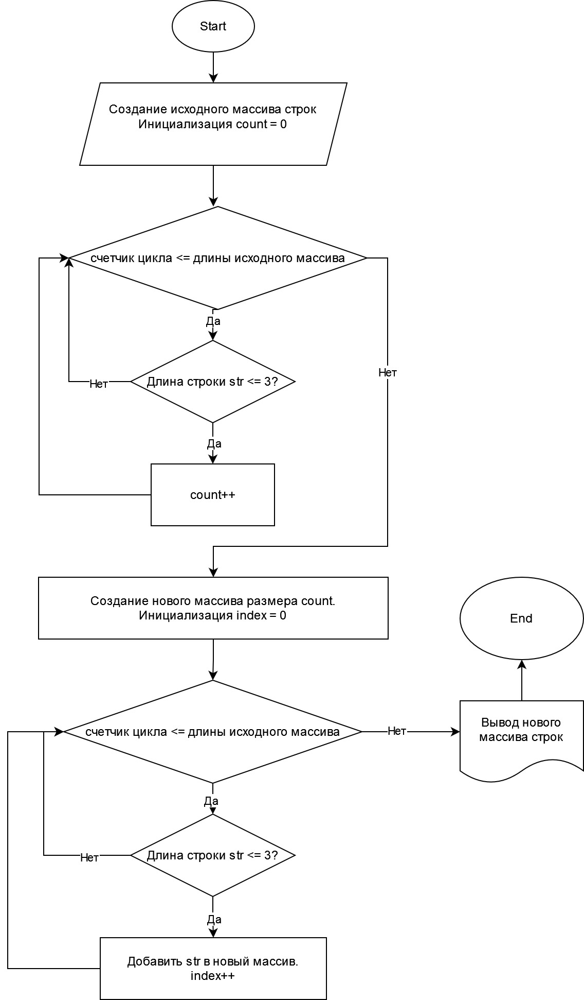

# Итоговая контрольная работа  студента Князева Р.Д. по основному блоку

## Описание
Программа предназначена для формирования нового массива строк из имеющегося массива строк, где в новый массив включаются только те строки, длина которых меньше или равна 3 символам. 

## Пример работы программы
Исходные данные: 
- `["Hello", "2", "world", ":-)"]`
- `["1234", "1567", "-2", "computer science"]`
- `["Russia", "Denmark", "Kazan"]`

Результат:
- `["2", ":-)"]`
- `["-2"]`
- `[]`

## Алгоритм работы
1. Создание исходного массива строк.
2. Инициализация счетчика для подсчета строк длиной ≤ 3 символа.
3. Цикл по элементам исходного массива с проверкой длины каждой строки.
4. Увеличение счетчика для каждой строки длиной ≤ 3 символа.
5. Создание нового массива строк длиной, равной значению счетчика.
6. Инициализация индекса для нового массива.
7. Цикл по элементам исходного массива с добавлением строк длиной ≤ 3 символа в новый массив.
8. Вывод результата.

## Блок-схема программы


## Код программы
```csharp
class Program
{
    static void Main()
    {
        // Исходный массив строк
        string[] initialArray = { "Hello", "2", "world", ":-)" };
        
        // Подсчет количества строк длиной ≤ 3 символа
        int count = 0;
        for (int i = 0; i < initialArray.Length; i++)
        {
            if (initialArray[i].Length <= 3)
            {
                count++;
            }
        }

        // Создание нового массива необходимого размера
        string[] resultArray = new string[count];

        // Заполнение нового массива подходящими строками
        int index = 0;
        for (int i = 0; i < initialArray.Length; i++)
        {
            if (initialArray[i].Length <= 3)
            {
                resultArray[index] = initialArray[i];
                index++;
            }
        }

        // Вывод результата
        Console.WriteLine("[" + string.Join(", ", resultArray) + "]");
    }
}